# Mailink System Architecture Document

## 1. Project Overview

### 1.1 Project Introduction

Mailink is an end-to-end encrypted instant messaging chat client based on email protocols + WebRTC P2P, with a decentralized signaling server. The email system is only used as the initial connection signaling transport channel, supporting smooth audio/video calls, ultra-large file high-speed transfer, traditional email sending and receiving, and is developed based on Electron.

For example, you can use Gmail and Outlook accounts for video calls and P2P file transfers.

### 1.2 Core Design Goals

| Goal | Description |
| - | - |
| **Extreme Responsiveness** | Through a multi-threaded architecture (Node.js Workers & Web Workers), offload compute-intensive tasks from the main thread to ensure UI smoothness |
| **Decentralized Signaling** | Use the email system as the signaling exchange medium for WebRTC, ensuring communication privacy and independence without relying on third-party signaling servers |
| **Modularity and Decoupling** | Frontend adopts Web Components technology stack, backend adopts a unified Worker management framework, ensuring high maintainability |
| **Cross-Platform Support** | Built on Electron, supporting Windows, macOS, and Linux desktop platforms |

### 1.3 Technology Stack

| Domain | Technology | Version |
| - | - | - |
| Desktop Framework | Electron | ^38.0.0 |
| Runtime | Node.js | Same as Electron bundled |
| Database | SQLite (better-sqlite3) | ^12.5.0 |
| Email Protocol | imap | ^0.8.19 |
| Email Protocol | nodemailer | ^7.0.10 |
| Email Parsing | mailparser | ^3.6.5 |
| Media Processing | mp4box | ^2.3.0 |
| Image Processing | sharp | ^0.34.5 |
| Database | mysql2 | ^3.19.1 |
| Frontend Components | Web Components (native) | - |
| Build Tool | electron-builder | ^24.0.0 |
| Package Manager | npm | - |

***

## 2. System Layered Architecture

### 2.1 Process and Thread Model

Mailink adopts a highly concurrent multi-process/multi-threaded architecture to ensure interface smoothness and efficient execution of background tasks:

| Layer | Technology Carrier | Core Responsibilities | Runtime Mode |
| - | - | - | - |
| **Main Process (Main)** | Node.js | Application lifecycle management, IPC routing, Worker thread pool management, native resource scheduling, system tray management | Single instance |
| **Node.js Workers** | `worker_threads` | Compute-intensive tasks: IMAP/SMTP protocol interaction, SQLite transaction processing, large file streaming writes, HTTP service running, attachment downloads, email parsing | Single instance / Thread pool |
| **Renderer Process (Renderer)** | Chromium | UI rendering, user interaction, Web Components container management | Per window |
| **Web Workers** | Web Worker API | Frontend background tasks: WebRTC signaling state machine, email polling scheduling, frontend cache management, data distribution | Multiple |

### 2.2 Architecture Layer Diagram

```
┌─────────────────────────────────────────────────────────────────────────────┐
│                           Renderer Process                                  │
│  ┌──────────────────────────────────────────────────────────────────────┐  │
│  │                     Web Components Layer                              │  │
│  │  ┌──────────────┐  ┌──────────────┐  ┌──────────────────────────┐   │  │
│  │  │MailinkSender │  │MailinkRecver │  │     MailinkChat          │   │  │
│  │  │ (Email Send) │  │ (Email Recv) │  │   (WebRTC Chat Component)│   │  │
│  │  └──────────────┘  └──────────────┘  └──────────────────────────┘   │  │
│  │  ┌──────────────┐  ┌──────────────┐  ┌──────────────────────────┐   │  │
│  │  │EmailList     │  │EmailDetail   │  │  FileDisplay Components  │   │  │
│  │  │ (Email List) │  │(Email Detail)│  │   (File Display Library) │   │  │
│  │  └──────────────┘  └──────────────┘  └──────────────────────────┘   │  │
│  │  ┌──────────────┐  ┌──────────────┐                                │  │
│  │  │ InboxPanel   │  │ContextMenu   │                                │  │
│  │  │(Inbox Panel) │  │(Context Menu)│                                │  │
│  │  └──────────────┘  └──────────────┘                                │  │
│  └──────────────────────────────────────────────────────────────────────┘  │
│                                    │                                        │
│  ┌──────────────────────────────────────────────────────────────────────┐  │
│  │                      Web Workers Layer                                │  │
│  │  ┌──────────┐ ┌──────────┐ ┌──────────┐ ┌──────────┐ ┌──────────┐   │  │
│  │  │Signaling │ │ Polling  │ │  Cache   │ │  Delete  │ │  Email   │   │  │
│  │  │  Worker  │ │Scheduler │ │  Worker  │ │  Queue   │ │Distributor│   │  │
│  │  └──────────┘ └──────────┘ └──────────┘ └──────────┘ └──────────┘   │  │
│  │  ┌──────────┐ ┌──────────┐ ┌──────────┐                              │  │
│  │  │  Utils   │ │  Hash    │ │ Video    │                              │  │
│  │  │  Worker  │ │  Worker  │ │ Poster   │                              │  │
│  │  └──────────┘ └──────────┘ └──────────┘                              │  │
│  └──────────────────────────────────────────────────────────────────────┘  │
└─────────────────────────────────────────────────────────────────────────────┘
                                      │
                                      ▼ IPC (Context Bridge)
┌─────────────────────────────────────────────────────────────────────────────┐
│                            Main Process                                     │
│  ┌──────────────┐  ┌──────────────┐  ┌──────────────┐  ┌──────────────┐    │
│  │   main.js    │──│  IPC Manager │──│ Worker Mgr   │──│ HTTP Server  │    │
│  └──────────────┘  └──────────────┘  └──────┬───────┘  └──────────────┘    │
│         │                                   │                               │
│         ▼                                   ▼                               │
│  ┌──────────────┐  ┌──────────────┐  ┌──────────────┐  ┌──────────────┐    │
│  │ IMAP Service │  │ SMTP Service │  │ SQLite Svc   │  │ File Service │    │
│  │(Parallel Dual│  │(Async Tasks) │  │(Conn Pool+  │  │(Streaming   │    │
│  │   Workers)   │  │              │  │   Batch)     │  │    Write)    │    │
│  └──────────────┘  └──────────────┘  └──────────────┘  └──────────────┘    │
│  ┌──────────────┐  ┌──────────────┐  ┌──────────────┐  ┌──────────────┐    │
│  │Img Thumbnail │  │File Security │  │System Tray   │  │Dialog Manager│    │
│  │  Generator   │  │  Validation  │  │ (Sys Tray)   │  │(Dialog Mgr)  │    │
│  └──────────────┘  └──────────────┘  └──────────────┘  └──────────────┘    │
└─────────────────────────────────────────────────────────────────────────────┘
                                      │
                                      ▼
┌─────────────────────────────────────────────────────────────────────────────┐
│                              Data Persistence Layer                           │
│  ┌──────────────┐  ┌──────────────┐  ┌──────────────┐  ┌──────────────┐    │
│  │  SQLite DB   │  │  File System │  │ IMAP Server  │  │ SMTP Server  │    │
│  │ (User Data)  │  │(Attach/Logs) │  │(Email Recv)  │  │(Email Send)  │    │
│  └──────────────┘  └──────────────┘  └──────────────┘  └──────────────┘    │
└─────────────────────────────────────────────────────────────────────────────┘
```

### 2.3 Inter-Process Communication Relationships

```mermaid
graph TB
    subgraph "Main Process"
        M[main.js]
        IPC[IPC Router]
        WM[WorkerManager]
        TR[System Tray]
    end

    subgraph "Node.js Workers"
        NW1[DB Worker]
        NW2[IMAP Normal Fetch Worker]
        NW3[IMAP Signaling Fetch Worker]
        NW4[IMAP Management Worker]
        NW5[SMTP Worker Pool]
        NW6[File Writer Worker]
        NW7[HTTP Server Worker]
        NW8[Email Parser Worker]
        NW9[Attachment Download Worker]
        NW10[Email Batch Processor]
        NW11[Email Dedup Worker]
        NW12[Contact Backup Worker]
        NW13[Decoder Stream Worker]
        NW14[JSON Processor Worker]
        NW15[Cache Manager Worker]
    end

    subgraph "Renderer Process"
        UI[Web Components]
        WS[Worker System]
        CB[Context Bridge]
    end

    subgraph "Web Workers"
        WW1[Signaling Worker]
        WW2[Polling Scheduler]
        WW3[Cache Manager]
        WW4[Email Distributor]
        WW5[Delete Queue]
        WW6[Utils Worker]
        WW7[Hash Worker]
        WW8[Video Poster Worker]
    end

    M --> IPC
    M --> WM
    M --> TR
    WM --> NW1
    WM --> NW2
    WM --> NW3
    WM --> NW4
    WM --> NW5
    WM --> NW6
    WM --> NW7
    WM --> NW8
    WM --> NW9
    WM --> NW10
    WM --> NW11
    WM --> NW12
    WM --> NW13
    WM --> NW14
    WM --> NW15

    UI --> WS
    WS --> WW1
    WS --> WW2
    WS --> WW3
    WS --> WW4
    WS --> WW5
    WS --> WW6
    WS --> WW7
    WS --> WW8
    UI --> CB

    CB <--> IPC
```



***

## 3. Core Modules in Detail

### 3.1 Unified Worker Management Framework (`shared/worker/`)

The project implements a generic `WorkerManager` supporting two runtime modes:

#### 3.1.1 Runtime Modes

| Mode | Applicable Scenarios | Characteristics |
| - | - | - |
| **Single Mode** | IMAP connections, database operations | Ensures state consistency, avoids concurrency conflicts |
| **Pool Mode** | SMTP sending, file writing | Multi-threaded parallelism, improves throughput |

#### 3.1.2 Core Features

- **Timeout and Retry**: Built-in `withTimeout` mechanism, automatically handles Worker hangs and supports automatic restart
- **Health Checks**: Periodically detects Worker status, automatically rebuilds on exceptions
- **Task Queue**: Supports task queuing and priority scheduling
- **Log Capture**: Automatically captures Worker stdout and stderr output

#### 3.1.3 Module Structure

| File | Responsibility |
| - | - |
| `worker-manager.js` | Worker manager core implementation, supports single instance and thread pool modes |
| `worker-factory.js` | Worker factory function, creates specific types of Worker managers |
| `index.js` | Module export entry |

#### 3.1.4 BaseWorkerManager Base Class

`service/base-worker-manager.js` provides the Worker manager base class, uniformly managing lifecycle:

| Method | Responsibility |
| - | - |
| `getWorkerPath()` | Implemented by subclass, returns Worker script path |
| `getManagerName()` | Implemented by subclass, returns manager name |
| `getDefaultStats()` | Implemented by subclass, returns initial statistics object |
| `handleCustomMessage(response)` | Optionally overridden by subclass, handles special message types |

Subclasses inheriting from BaseWorkerManager include: `EmailParserManager`, `AttachmentDownloadManager`, `FileValidatorManager`.

### 3.2 Email Service Module (`service/mail/`)

#### 3.2.1 Module Structure

| File | Responsibility |
| - | - |
| `imap.js` | IMAP protocol main entry, registers IPC handlers, manages full email fetch flow |
| `smtp.js` | SMTP protocol main entry, async task-style sending, auto-adds contacts |
| `imap-connection-manager.js` | IMAP long connection manager, maintains multi-connection pool |
| `connection-pool.js` | Connection pool implementation, heartbeat detection, health checks, auto-reconnect |
| `connection-strategy.js` | Connection strategy management, allocates connection pools by scenario |
| `connection-diagnostic.js` | Connection diagnostic tool, collects and analyzes connection issues |
| `signaling-state-manager.js` | Signaling state management, coordinates email polling frequency |
| `email-dedup-manager.js` | Email deduplication management (based on UID and Message-ID) |
| `cache/email-dedup-lru.js` | Email deduplication based on LRU cache |
| `email-queue-manager.js` | Email queue manager, two-level queues (critical/normal) and Worker pool |
| `email-processor-service.js` | Email processing service, encapsulates queue operations, provides clean API |
| `email-to-chat-message.js` | Email to chat message conversion, supports image/text/friend request etc. special types |
| `email-parser-manager.js` | Email parsing manager |
| `imap-idle-manager.js` | IMAP IDLE mode management (regular version) |
| `imap-idle-manager-queue.js` | IMAP IDLE mode management (queue-integrated version) |
| `imap-reconnect-manager.js` | IMAP auto-reconnect management (exponential backoff) |
| `imap-health-checker.js` | IMAP connection health check |
| `imap-health-check-worker.js` | IMAP health check Worker |
| `imap-database.js` | IMAP database operations (batch save, query, etc.) |
| `imap-flags-sync.js` | IMAP flags sync (read/deleted status sync to server) |
| `imap-flags-sync-manager.js` | IMAP flags sync manager |
| `imap-flags-lock-manager.js` | IMAP flags lock manager (multi-threaded safety) |
| `imap-node-imap-patch.js` | node-imap library patch |
| `imap-session-logger.js` | IMAP session log (recorded per session) |
| `imap-logger.js` | IMAP logging |
| `smtp-logger.js` | SMTP logging |
| `smtp-worker.js` | SMTP Worker thread (connection reuse, health check) |
| `smtp_restored.js` | SMTP restore module (email sending restore logic) |
| `attachment-download-manager.js` | Attachment download manager (based on BaseWorkerManager) |
| `download-queue.js` | Email attachment download queue manager (concurrency control) |
| `imap-attachment-downloader.js` | IMAP attachment downloader (traditional way) |
| `imap-attachment-downloader-streaming.js` | IMAP attachment streaming downloader |
| `contact-backup.js` | Contact backup (backup to mailbox) |
| `contact-backup-restore.js` | Contact restore (restore from backup email) |
| `batch-utils.js` | Batch processing utility functions |
| `streaming-decoder.js` | Streaming Worker decoder pool (Base64/QP decoding) |

#### 3.2.2 IMAP Parallel Dual Worker Architecture

Mailink adopts two independent Workers to fetch signaling emails and normal emails in parallel, greatly improving efficiency:

| Worker | Responsibility | Characteristics |
| - | - | - |
| **Normal Fetch Worker** (`imap-normal-fetch.worker.js`) | Fetch normal emails | Batch processing, does not block signaling emails |
| **Signaling Fetch Worker** (`imap-signaling-fetch.worker.js`) | Fetch WebRTC signaling emails | Fast response, only processes emails with signaling prefix |

Both Workers share the same connection manager but use independent connection pools (POLLING connection pool), ensuring no interference.

#### 3.2.3 Email Queue and Async Processing

`EmailQueueManager` implements a two-level queue mechanism:

| Priority | Queue | Purpose |
| - | - | - |
| **High (Critical)** | critical queue | WebRTC signaling emails, processed first |
| **Normal (Normal)** | normal queue | Normal emails, processed with delay |

- Uses Worker pool (default `min(4, CPU cores)`) to parse emails in parallel
- Supports task timeout (default 30 seconds) and error isolation
- Provides statistics (completed tasks, failed tasks, etc.)

#### 3.2.4 Email to Chat Message Conversion

`email-to-chat-message.js` converts normal emails to chat messages:

| Email Type | Chat Message type | Description |
| - | - | - |
| Normal email | type=2 | content=📧 Email Subject |
| `mailink_picture:` subject | type=3 | content=📧 Subject + Image HTML |
| `mailink_text:` subject | type=3 | Plain text message |
| `mailink_addfriend:` subject | type=2 | Friend request notification |
| Signaling email | Skip | Not converted to chat message |

#### 3.2.5 IMAP Connection Pool Strategy

The IMAP connection manager maintains 4 types of connection pools for different scenarios:

| Connection Pool | Purpose | Characteristics |
| - | - | - |
| **MAIN** | Main connection | Regular email operations |
| **DELETE** | Delete operations | Isolate delete operations, avoid blocking main connection |
| **IDLE** | Real-time push | Supports IDLE mode, receives new email notifications in real time |
| **POLLING** | Polling fetch | Scheduled polling, compatible with servers that do not support IDLE |

#### 3.2.6 Connection Pool Features

- **Heartbeat Detection**: Periodically sends NOOP commands to detect connection health (default 120 seconds)
- **Auto Reconnect**: Exponential backoff reconnection mechanism (max 10 retries, max delay 5 minutes)
- **Idle Cleanup**: Automatically disconnects after 30 minutes of idle time
- **Connection Warm-up**: Automatically warms up connections on application startup
- **Statistics Monitoring**: Records connection check count, success/failure count, average lifecycle, etc.

#### 3.2.7 Signaling State Manager

`SignalingStateManager` is a singleton module used to track WebRTC signaling transmission state:

- **State Tracking**: Records whether signaling transmission is active
- **Timeout Protection**: 5-second timeout automatically ends signaling state
- **Event Notification**: Supports listener registration, notifies all listeners when state changes

#### 3.2.8 Email Worker File List

| Worker File | Responsibility |
| - | - |
| `workers/imap-normal-fetch.worker.js` | Normal email fetch |
| `workers/imap-signaling-fetch.worker.js` | Signaling email fetch |
| `workers/imap-management.worker.js` | IMAP management operations (search/delete emails) |
| `workers/email-parser.worker.js` | Email parsing (based on mailparser) |
| `workers/email-processor.worker.js` | Email processing (queue Worker pool) |
| `workers/email-batch-processor.worker.js` | Email batch processing |
| `workers/email-dedup.worker.js` | Email deduplication |
| `workers/fetch-email-body.worker.js` | Email body fetch |
| `workers/attachment-download.worker.js` | Attachment download |
| `workers/imap-flags-sync.worker.js` | IMAP flags sync |
| `workers/contact-backup.worker.js` | Contact backup |
| `workers/contact-backup-restore.worker.js` | Contact backup restore |

### 3.3 Database Service Module (`service/sqlite/`)

#### 3.3.1 Module Structure

| File | Responsibility |
| - | - |
| `sqlite.js` | SQLite main module, registers IPC handlers (including contact auto-backup) |
| `sqlite-unified.js` | Unified database operation API, encapsulates connection pool and ORM |
| `tpish-sqlite.js` | ORM implementation, based on better-sqlite3 |
| `sqlite-base.js` | Low-level database operation base class |
| `sqlite-worker.js` | SQLite Worker thread |
| `sqlite-batch-manager.js` | Batch operation manager (batching + Worker scheduling) |
| `sqlite-batch-worker.js` | Batch operation Worker thread |
| `db-logger.js` | Database operation log |
| `workers/db.worker.js` | Database Worker thread (compatibility layer) |

#### 3.3.2 Multi-Account Isolation Design

Each email account has an independent `.db` file:

```
resources/
├── sys/
│   └── config.db             # Global configuration database
├── users/
│   └── {username}/
│       └── {username}_emails.db  # User email database
```

#### 3.3.3 Core Table Structure

| Table Name | Purpose | Key Fields |
| - | - | - |
| `message` | Message storage | id, msgid, fromer, toer, content, createtime, type, status |
| `contact` | Contact management | id, nickname, username, avatar, status |
| `signaling_cache` | Signaling cache | id, cache_name, email_id, last_access_time, created_time |
| `transfer_metadata` | File transfer metadata | id, msg_id, file_name, file_path, total_size, received_size, file_hash, createtime, metadata |
| `pending_images` | Pending send images | id, msgid, filename, file_path, mime_type, size, fromer, toer, status, createtime |
| `recv` | Receive records | id, dstr, createtime |
| `send` | Send records | id, dstr, createtime |

#### 3.3.4 Connection Pool Design

The `DatabasePool` class implements the database connection pool:

- **Max Connections**: Up to 5 connections per database file
- **Wait Queue**: Automatically queues when connections are insufficient
- **Auto Release**: Automatically returns to pool after use
- **WAL Mode**: Uses WAL log mode to support multi-process concurrent access

```javascript
// ORM-style operations
const result = await UnifiedDB.withORM(dbPath, (orm) => {
  return orm.table('message')
    .where({ fromer: userEmail })
    .orderBy('createtime DESC')
    .limit(50)
    .select();
});

// Raw SQL query
const row = await UnifiedDB.get(dbPath, 
  'SELECT * FROM contact WHERE username = ?', 
  [email]
);
```

#### 3.3.5 Batch Operation Manager

`SQLiteBatchManager` implements efficient batch writes:

- **Batching Mechanism**: Accumulates up to 1000 records or 500ms timeout before batch write
- **Worker Isolation**: Each database file uses an independent Worker thread
- **Error Isolation**: Single record failure does not affect other records

### 3.4 WebRTC Chat Component (`www/webrtc/`)

#### 3.4.1 Component Architecture

Built using the **Web Components** standard, implementing a highly encapsulated `MailinkChat` component:

```
webrtc/
├── manager.js                    # WebRTC manager (Webcom container management)
├── manager.worker.js             # WebRTC management Worker
├── signaling.worker.js           # Signaling processing Worker
└── chat-component/
    ├── index.js                  # Component main entry
    ├── chat-context.js           # Component context
    ├── chat-template.js          # Component template
    ├── chat-component.css        # Component styles
    ├── chat-component.html       # Component HTML
    ├── components/
    │   └── emoji-picker.js       # Emoji picker
    └── modules/
        ├── connection/           # WebRTC connection management
        │   ├── connection-core.js          # Connection core (state management, ICE queue)
        │   ├── connection-attachments.js   # Connection attachment handling
        │   └── connection-signaling.js     # Connection signaling
        ├── file-transfer/        # File transfer
        │   ├── index.js                    # File transfer entry
        │   ├── file-transfer-sender.js     # File sender
        │   ├── file-transfer-receiver.js   # File receiver
        │   ├── file-transfer-sender-utils.js       # Sender utilities
        │   ├── file-transfer-sender-persistence.js # Sender persistence
        │   ├── file-transfer-state.js      # Transfer state
        │   └── file-transfer-ui.js         # Transfer UI
        ├── mp4-streaming/        # MP4 streaming receive
        │   ├── mp4-streaming-receiver.js   # MP4 stream receiver
        │   ├── mp4-video-player.js         # Video player
        │   ├── mp4-state-manager.js        # State management
        │   ├── mp4-data-handler.js         # Data handling
        │   ├── mp4-poster-handler.js       # Poster handling
        │   ├── mp4-connection-handler.js   # Connection handling
        │   ├── mp4-moov-reassembler.js     # moov box reassembly
        │   ├── mp4-range-manager.js        # Range management
        │   └── mp4-utils.js                # Utility functions
        ├── mp4-streaming-sender/  # MP4 streaming send
        │   ├── mp4-streaming-sender.js     # MP4 stream sender
        │   ├── mp4-structure-analyzer.js   # MP4 structure analysis
        │   ├── mp4-analyzer.worker.js      # MP4 analysis Worker
        │   ├── playback-plan-builder.js    # Playback plan builder
        │   ├── streaming-data-sender.js    # Streaming data sender
        │   ├── transfer-progress-tracker.js # Transfer progress tracking
        │   └── mp4-box-parser.js           # MP4 box parser
        ├── signaling.js          # Signaling handling
        ├── data-channel.js       # Data channel management
        ├── file-transfer.js      # File transfer (compatibility layer)
        ├── chat.js               # Chat message management
        ├── chat-message.js       # Message management (message types, rendering)
        ├── chat-history.js       # Chat history loading
        ├── chat-status-sync.js   # Status sync (read receipts, etc.)
        ├── chat-file-render.js   # Chat file rendering
        ├── chat-file-update.js   # Chat file update
        ├── media.js              # Media calls
        ├── ui-renderer.js        # UI rendering
        ├── avatar.js             # Avatar management
        ├── event-bus.js          # Event bus
        ├── utils.js              # Utility functions
        ├── config.js             # Configuration
        ├── logger.js             # Logging
        └── nat-detector.js       # NAT type detection
```

#### 3.4.2 Core Features

- **Shadow DOM Isolation**: Ensures chat interface styles do not pollute the global scope
- **Event Bus (EventBus)**: Internal component modules are decoupled through the event bus
- **Modular Design**: Each functional module is independent, easy to maintain and test
- **Async Initialization**: Supports async loading of CSS and HTML templates
- **MP4 Streaming Transfer**: Supports parsing and playing large video files while streaming

#### 3.4.3 Role Determination Mechanism (Polite/Impolite)

WebRTC uses email address lexicographical order to determine roles, resolving call conflicts:

```javascript
// Smaller email is Sender (Impolite), actively sends Offer
// Larger email is Receiver (Polite), passively receives Offer
function isPolite(myEmail, targetEmail) {
    return myEmail > targetEmail;  // lexicographical comparison
}
```

| Role | Condition | Behavior |
| - | - | - |
| **Sender (Impolite)** | myEmail < targetEmail | Actively initiates Offer, takes priority on conflict |
| **Receiver (Polite)** | myEmail > targetEmail | Passively receives Offer, yields on conflict |

#### 3.4.4 Signaling Flow

```
Sender (Impolite)              Receiver (Polite)
     |                                |
     |--- 1. Discover --------------->|  (Discover peer online)
     |                                |
     |--- 2. Offer ------------------>|  (Send SDP Offer via email)
     |                                |
     |<-- 3. Answer ------------------|  (Send SDP Answer via email)
     |                                |
     |--- 4. ICE Candidates --------->|  (Exchange ICE candidates)
     |<-- 5. ICE Candidates ----------|
     |                                |
     |========= Connection Established =========|
     |<-> 6. Data Channel <---------->|  (Establish data channel, start communication)
```

#### 3.4.5 Auto-Reconnect Mechanism

```javascript
// Auto-trigger reconnect when connection drops
handleReconnect() {
    // 1. Debounce check (only execute once within 8 seconds)
    // 2. Clean up existing connection resources
    // 3. Decide reconnect strategy based on role
    //    - Receiver: Send discover email to notify peer
    //    - Sender: Actively initiate Offer
    // 4. Backoff retry mechanism
}
```

#### 3.4.6 Connection Manager Core

The `ConnectionCore` class is responsible for WebRTC connection lifecycle management:

- **State Management**: Maintains connection state, retry count, ICE candidate queue
- **Debounce Mechanism**: Only reconnects once within 8 seconds to prevent frequent triggers
- **Email Validation**: Ensures email info is complete before executing connection operations
- **Event Driven**: Listens for reconnect requests and target email changes through EventBus

### 3.5 HTTP Service Module (`service/http/`)

#### 3.5.1 Module Responsibilities

Provides a local HTTP file server for:

- Local file preview (images, videos, etc.)
- File access for WebRTC transfer
- Attachment download

#### 3.5.2 Module Structure

| File | Responsibility |
| - | - |
| `http-server-manager.js` | HTTP server manager, port management |
| `http-server.worker.js` | HTTP server Worker, Express service |

#### 3.5.3 Port Management

- **Dynamic Port**: Automatically generates random ports in the 20001-65535 range
- **Port Detection**: Detects whether port is available before startup
- **Max Retries**: Attempts up to 10 times to find an available port
- **Global Storage**: Port info stored in `global.httpServerPort`

### 3.6 File Service Module (`service/files/`)

#### 3.6.1 Module Responsibilities

Handles streaming file writes and batch operations:

| File | Responsibility |
| - | - |
| `workers/file-writer.worker.js` | File write Worker |
| `workers/file-writer-manager.js` | File write manager (supports random position writes) |
| `workers/file-copy.worker.js` | File copy Worker |
| `workers/file-copy-manager.js` | File copy manager |
| `workers/file-hash.worker.js` | File hash calculation Worker |
| `workers/file-hash-manager.js` | File hash calculation manager |
| `workers/file-validator.worker.js` | File validation Worker |
| `file-validator-manager.js` | File validation manager |
| `log-append-manager.js` | Log append write manager |
| `file-hash-utils.js` | File hash utility functions |

#### 3.6.2 Streaming Write Features

- **Write While Receiving**: Real-time disk writes during file transfer, extremely low memory usage
- **Random Position Write**: Supports writing from arbitrary offset (resumable transfer)
- **Resumable Transfer**: Resumes file transfer after interruption, automatically syncs progress to `transfer_metadata` table
- **Integrity Verification**: Performs size verification after file write completion
- **Batch Write**: Supports batch file write operations, 5 files per batch

### 3.7 Image Processing Module (`service/images/`)

| File | Responsibility |
| - | - |
| `thumbnail-generator.js` | Image thumbnail generator |
| `workers/thumbnail.worker.js` | Thumbnail generation Worker |

Uses the `sharp` library for high-performance image processing, supports generating thumbnails of specified width for email attachment preview.

### 3.8 File Security Module (`service/security/` + `shared/security/`)

#### 3.8.1 Architecture Design

File security validation is divided into three layers:

| Layer | File | Responsibility |
| - | - | - |
| Shared Constants Layer | `shared/security/file-security-common.js` | Single source of dangerous extensions and MIME type lists |
| Browser Adapter Layer | `shared/security/file-security.js` | Frontend file security validation |
| Node.js Adapter Layer | `service/security/file-security-node.js` | Backend file security validation (validate attachments in Worker) |

#### 3.8.2 Security Policy

- **Dangerous Extensions**: exe, dll, scr, bat, cmd, ps1, vbs, js and other executable/script files
- **Dangerous MIME Types**: `application/x-msdownload`, etc.
- **Worker Integration**: File security validation runs synchronously in SMTP Worker, blocking dangerous attachment uploads

### 3.9 File Display Component Library (`www/components/file-display/`)

#### 3.9.1 Component Overview

The file display component library is a collection of components based on the Web Components standard, used to display different types of files in the chat interface.

#### 3.9.2 Component Structure

```
file-display/
├── index.js                      # Unified entry, exports factory function
├── base/
│   └── file-display-base.js      # Base component class
├── components/
│   ├── image-file-display/
│   │   └── image-file-display.js # Image display component
│   ├── audio-file-display/
│   │   └── audio-file-display.js # Audio display component
│   ├── normal-file-display/
│   │   └── normal-file-display.js # Normal file display component
│   └── video-file-display/
│       └── video-file-display.js # Video display component
└── utils/
    └── file-type-resolver.js     # File type resolver
```

#### 3.9.3 Component Types

| Component | Tag Name | Purpose |
| - | - | - |
| `ImageFileDisplay` | `image-file-display` | Display image files, supports preview |
| `VideoFileDisplay` | `video-file-display` | Display video files, supports streaming playback |
| `AudioFileDisplay` | `audio-file-display` | Display audio files, supports playback controls |
| `NormalFileDisplay` | `normal-file-display` | Display normal files, shows file icon and info |

### 3.10 Email Components (`www/mailsender/`, `www/mailrecver/`)

#### 3.10.1 Email Receive Component (`MailinkRecver`)

| File | Responsibility |
| - | - |
| `index.js` | MailinkRecver component definition |
| `recvmail.js` | Email receive logic |
| `recvmail.html` | Email receive page |

#### 3.10.2 Email Send Component (`MailinkSender`)

| File | Responsibility |
| - | - |
| `index.js` | MailinkSender component definition |
| `sendmail.js` | Email send logic |
| `sendmail.html` | Email send page |
| `avatar.js` | Avatar processing |
| `template.js` | Template functions |
| `js/` | JS modules (ui.js, email.js, utils.js, constants.js) |
| `contact-list-component/` | Contact list sub-component |

### 3.11 Email List and Detail Components

#### 3.11.1 Email List Component (`EmailListComponent`)

| File | Responsibility |
| - | - |
| `www/email-list-component/index.js` | Component definition |
| `www/email-list-component/email-list.css` | Styles |
| `www/email-list-component/email-list.html` | Template |

#### 3.11.2 Email Detail Component (`EmailDetailComponent`)

| File | Responsibility |
| - | - |
| `www/email-detail-component/index.js` | Component definition |
| `www/email-detail-component/email-detail.css` | Styles |
| `www/email-detail-component/email-detail.html` | Template |

#### 3.11.3 Inbox Panel Component (`InboxPanelComponent`)

| File | Responsibility |
| - | - |
| `www/inbox-panel-component/index.js` | Component definition |
| `www/inbox-panel-component/inbox-panel.css` | Styles |
| `www/inbox-panel-component/inbox-panel.html` | Template |

### 3.12 Context Menu Component (`www/components/context-menu/`)

| File | Responsibility |
| - | - |
| `context-menu.js` | Custom context menu component, supports copy, paste, and other operations |

### 3.13 Frontend Service Layer (`www/services/`)

#### 3.13.1 Module Structure

| File | Responsibility |
| - | - |
| `worker-system.js` | Worker system management, phased initialization of core and business Workers |
| `imap-service.js` | IMAP service encapsulation (Worker health checks, state management) |
| `imap-service.worker.js` | IMAP service Worker (email fetch, connection sync) |
| `polling-scheduler.worker.js` | Polling scheduler (supports pause/resume/signaling high-frequency mode) |
| `email-distributor.worker.js` | Email distributor (separates signaling emails from normal emails) |
| `delete-queue.worker.js` | Delete queue (merges batch delete requests) |
| `cache-manager.worker.js` | Cache management (SQLite cache proxy) |
| `config-manager.js` | Configuration management (email config read/write) |
| `sqlite-cache-proxy.js` | SQLite cache proxy (in-memory cache acceleration) |
| `utils.worker.js` | Utility Worker |
| `hash.worker.js` | Hash calculation Worker |
| `debug-fetch-emails.js` | Email fetch debugging tool |

#### 3.13.2 Phased Worker Initialization

```javascript
// Phase 1: Initialize core Workers (called before login)
function initCoreWorkers() {
    // Only initialize IMAP service Worker (needed for login)
    imapServiceWorker = workerManager.initWorker('imapServiceWorker', ...);
}

// Phase 2: Initialize business Workers (called after successful login)
function initBusinessWorkers(myEmail) {
    // Initialize email distributor, polling scheduler, delete queue, etc.
    emailDistributor = workerManager.initWorker('emailDistributor', ...);
    pollingScheduler = workerManager.initWorker('pollingScheduler', ...);
    deleteQueueWorker = workerManager.initWorker('deleteQueueWorker', ...);
    // ...
}
```

### 3.14 Contact Backup and Restore

Mailink implements automatic contact backup to mailbox:

| Module | Responsibility |
| - | - |
| `service/mail/contact-backup.js` | Contact backup main logic, debounced trigger (3 seconds) |
| `service/mail/contact-backup-restore.js` | Restore contacts from backup email |
| `workers/contact-backup.worker.js` | Backup Worker |
| `workers/contact-backup-restore.worker.js` | Restore Worker |

- **Auto Trigger**: 3-second debounced automatic backup after contact changes
- **Backup Format**: CSV file sent as email attachment
- **Startup Restore**: Automatically restores contacts from mailbox on application startup

### 3.15 Application Initialization Module (`service/app-initializer.js`)

Responsible for directory structure initialization during application startup:

| Method | Responsibility |
| - | - |
| `initializeAppDirectories()` | Initialize base directories (resources, log, etc.) |
| `initializeUserDirectories(username)` | Create user directories after user login |

Directory structure:
```
resources/
├── users/
│   ├── log/                    # Global log directory
│   └── {username}/             # User data directory
│       ├── files/
│       │   ├── recvs/          # Received files
│       │   └── sends/          # Sent files
│       ├── log/                # User log directory
│       └── {username}_emails.db # User database
```

### 3.16 Internationalization Multi-Language Module (`www/i18n.js`)

#### 3.16.1 Supported Languages

Mailink has full translations for **13 languages** built-in, managed through a unified i18n framework:

| Language Code | Language Name | Locale |
| - | - | - |
| `tc` | Traditional Chinese (Taiwan) | zh-TW |
| `sc` | Simplified Chinese | zh-CN |
| `en` | English | en-US |
| `es` | Spanish | es-ES |
| `de` | German | de-DE |
| `ja` | Japanese | ja-JP |
| `fr` | French | fr-FR |
| `pt` | Portuguese | pt-PT |
| `ru` | Russian | ru-RU |
| `it` | Italian | it-IT |
| `nl` | Dutch | nl-NL |
| `pl` | Polish | pl-PL |
| `tr` | Turkish | tr-TR |

#### 3.16.2 File Structure

```
resources/sys/
├── lang.json                     # Language list configuration
└── lang/                         # Language translation files
    ├── tc.json                   # Traditional Chinese (default)
    ├── sc.json                   # Simplified Chinese
    ├── en.json                   # English
    ├── ja.json                   # Japanese
    ├── de.json                   # German
    ├── fr.json                   # French
    ├── es.json                   # Spanish
    ├── pt.json                   # Portuguese
    ├── ru.json                   # Russian
    ├── it.json                   # Italian
    ├── nl.json                   # Dutch
    ├── pl.json                   # Polish
    └── tr.json                   # Turkish

www/
└── i18n.js                       # Internationalization engine (frontend runtime)
```

#### 3.16.3 Translation Engine

`www/i18n.js` implements a lightweight frontend internationalization engine:

| Method | Responsibility |
| - | - |
| `t(key, params)` | Get translated text by key, supports parameter replacement (e.g. `{count}`) |
| `init(root)` | Initialize i18n, load current language JSON translation file |
| `setLang(lang)` | Switch language, reload translation and refresh all UI elements |
| `getLang()` | Get current language code |
| `getLocale()` | Get current language BCP 47 locale identifier (e.g. `zh-CN`) |
| `initElements(root)` | Scan DOM elements with `data-i18n` attribute and fill translations |
| `refreshAll()` | Refresh translations for all registered root nodes |
| `registerRoot(root)` / `unregisterRoot(root)` | Register/unregister Shadow DOM root nodes (used inside Web Components) |
| `loadLangList()` | Load `lang.json` to get supported language list |
| `renderLangSelect(selectElement)` | Render language selection dropdown |

#### 3.16.4 Working Mechanism

Translation files are in JSON format, organized by **namespaces**:

```json
{
  "_meta": { "lang": "zh-CN", "name": "Simplified Chinese", "version": "1.0.0" },
  "app": { "title": "Mailink - Email Chat" },
  "common": { "close": "Close", "send": "Send" },
  "login": { "selectEmail": "Please select login email" },
  "chat": { "inputPlaceholder": "Enter message..." }
}
```

Frontend marks elements requiring translation via the `data-i18n` attribute:

```html
<span data-i18n="common.close">Close</span>
<input data-i18n-placeholder="chat.inputPlaceholder">
```

**Features:**
- **Default Language**: Traditional Chinese (`tc`)
- **Language Persistence**: User selection stored in `localStorage` (key: `mailink-lang`)
- **Shadow DOM Support**: Web Components can register their Shadow Root via `registerRoot()` for internal translation
- **Event Notification**: Triggers `lang-changed` custom event on language switch, all components can respond
- **Auto Load**: Automatically initializes on page load, no manual call needed

#### 3.16.5 Packaging and Release

During packaging, all language files in `resources/sys/lang/` are packaged with ASAR:
```yaml
extraResources:
  - from: "resources"
    to: "."
    filter: ["**/*"]
```

Users can switch languages at any time through the language selection dropdown in the UI without restarting the application.

***

## 4. Communication Mechanisms

### 4.1 IPC Communication (Main <-> Renderer)

#### 4.1.1 Security Proxy

Exposes a limited `electronAPI` through `preload.js` `contextBridge`:

```javascript
// preload.js
const { contextBridge, ipcRenderer, webUtils } = require('electron');

contextBridge.exposeInMainWorld('electronAPI', {
  // File path retrieval (recommended way in Electron 20+)
  getFilePath: (file) => webUtils.getPathForFile(file),
  
  // Batch IPC requests
  batchIpcRequest: (requests) => { /* ... */ },
  
  // Database operations
  queryDatabase: (dbPath, sql, params) => 
    ipcRenderer.invoke('db-query', dbPath, sql, params),
  
  // File operations
  saveReceivedFile: (data) => 
    ipcRenderer.invoke('save-received-file', data),
  
  // Streaming write file chunk
  streamWriteFileChunk: (fileName, fileData, offset, totalSize, msgId, userId, flush, storedFileName) =>
    ipcRenderer.invoke('stream-write-file-chunk', ...),
  
  // Signaling state
  setSignalingState: (state) => 
    ipcRenderer.invoke('signaling-state', state),
  
  // Event listening
  onEmailReceived: (callback) => 
    ipcRenderer.on('email-received', callback)
});
```

#### 4.1.2 IPC Handler Categories

| Category | Handler Names | Description |
| - | - | - |
| **System** | `toggle-devtools`, `get-renderer-id`, `log-message`, `clipboard-read-files`, `window-control` | DevTools, logging, clipboard, window control |
| **Config** | `load-email-configs-from-db`, `save-email-config`, `update-email-config`, `get-current-config` | Email config management |
| **IMAP Email** | `login-imap-connection`, `fetch-emails`, `fetch-emails-parallel`, `disconnect-imap`, `get-imap-status`, `pre-warm-imap-connection`, `search-and-delete-emails`, `delete-emails-by-uid` | IMAP connection and operations |
| **SMTP Email** | `sendmail`, `prewarm-smtp` | SMTP